# IPL Impulse

   
An Android app that helps you bet on your favourite team and award you based on your rate of prediction. The bets can be placed only before each IPL match starts.

## Rules:
* Bets are considered only if placed before the match starts. The moment the match commences the bets will be closed. 
* You get 100 points as credentials when you sign up. 
* If the team that you placed the bet on wins the match you get twice the amount of bet points that you've placed as bet, if not you do not lose or gain any points. 
* You can only bet on one team at a time. 
* Inviting your friends shall make the bet even more fun, since leader boards will be generated once the match comes to an end. 
* Ranks may be generated based on the user's activity in the app and their consistency in betting and ranks are not purly based on points. 
* Your Rank will be updated once for every 24 Hours. 

## Teams you can Support:
* CSK - Chennai Super Kings 
* KKR - Kolkata Knight Riders 
* MI - Mumbai Indians 
* RCB - Royal Challengers Bangalore 
* KXIP - Kings XI Punjab 
* DD - Delhi Daredevils 
* SRH - Sunrisers Hyderabad 
* RR - Rajasthan Royals 

## Screen Shots:

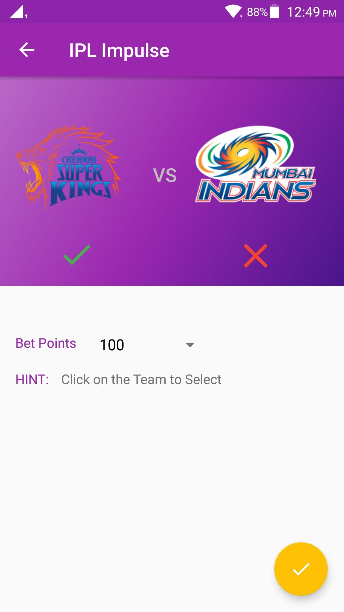
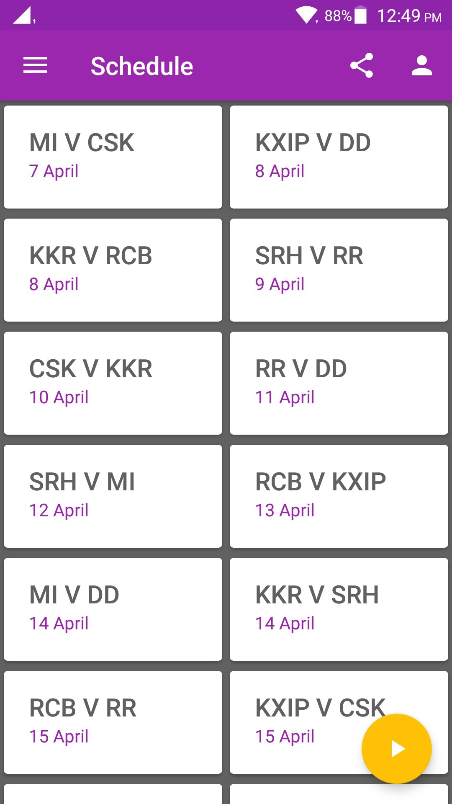
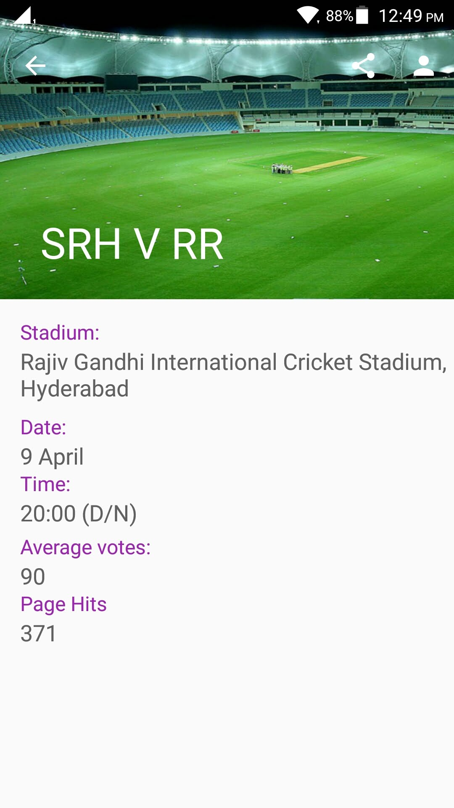
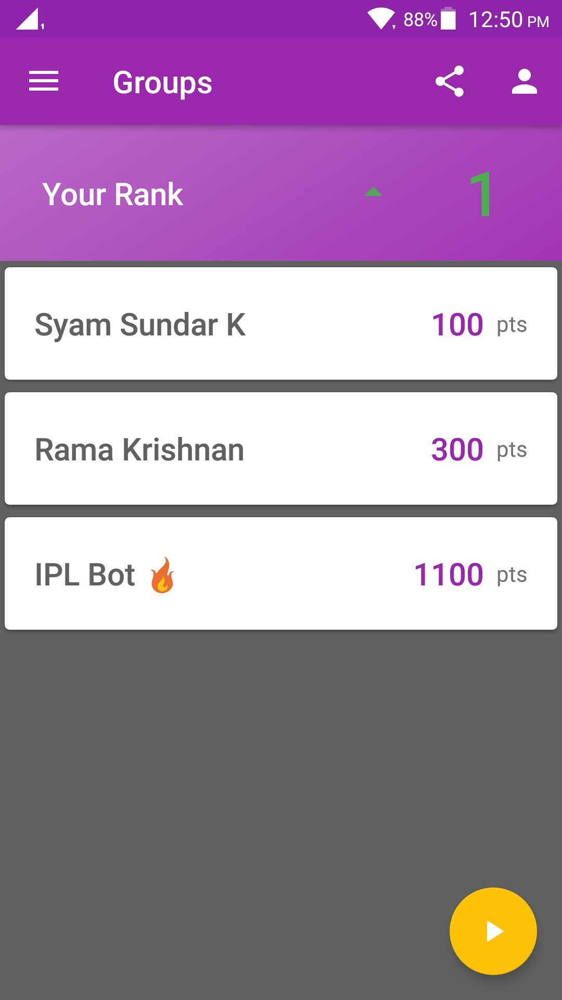
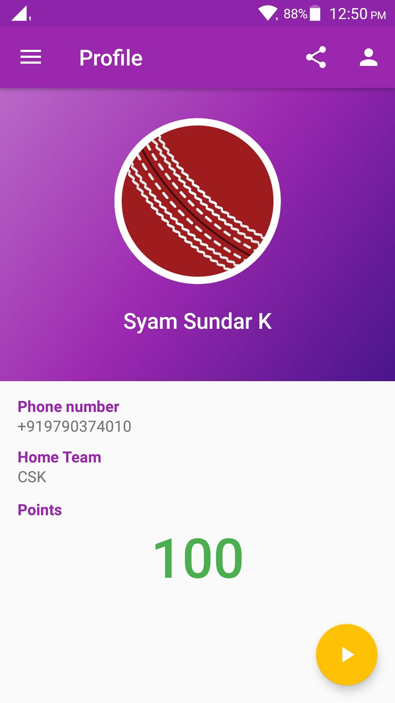
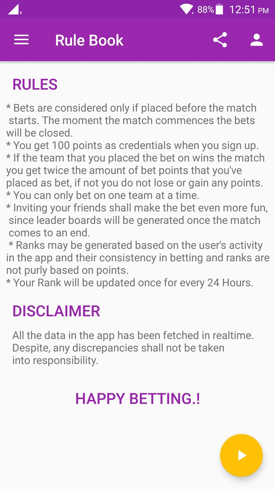
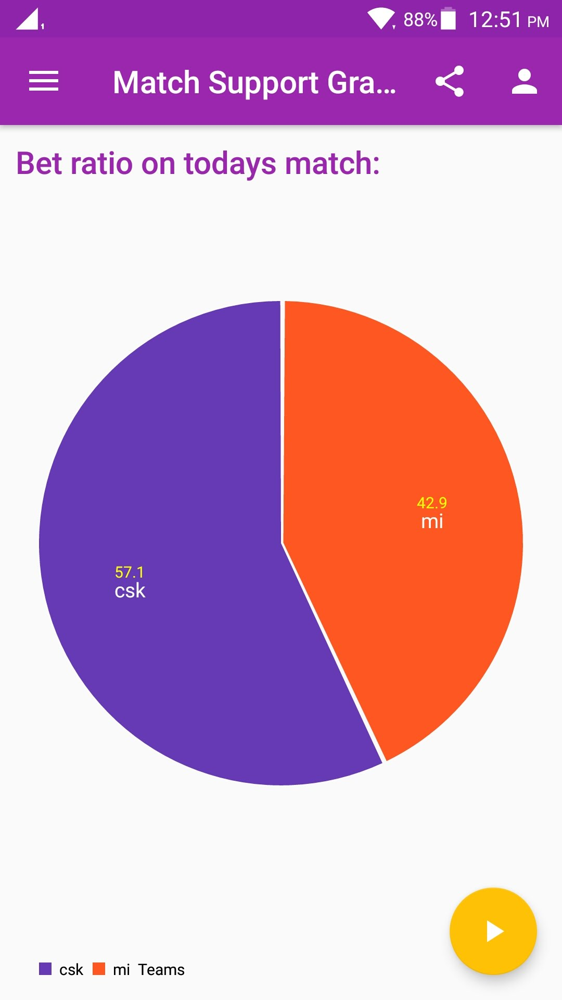

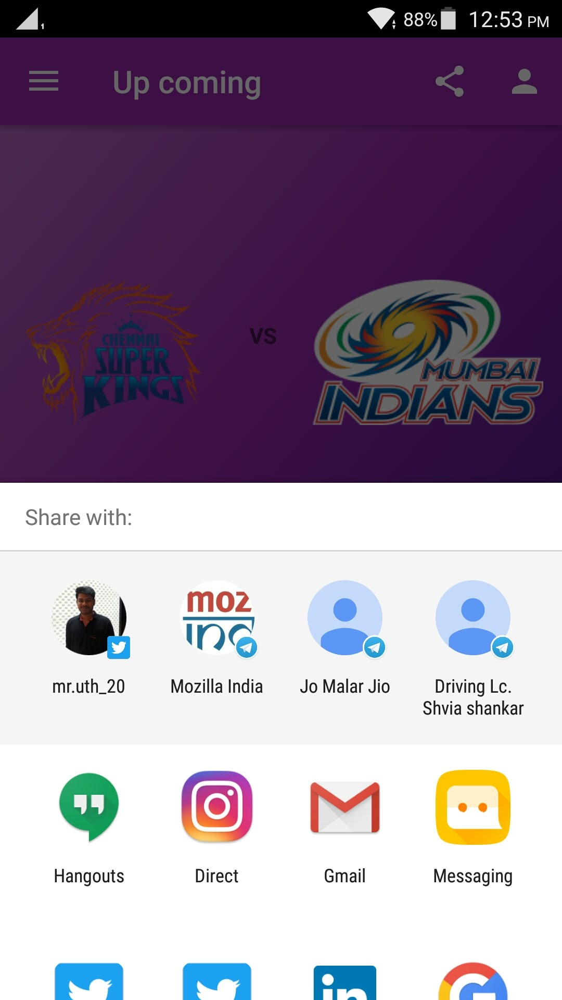
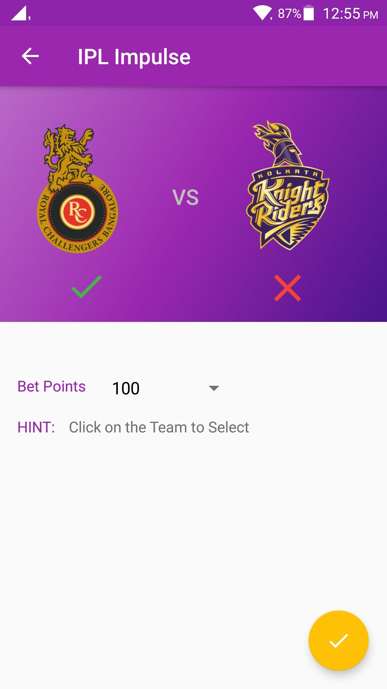
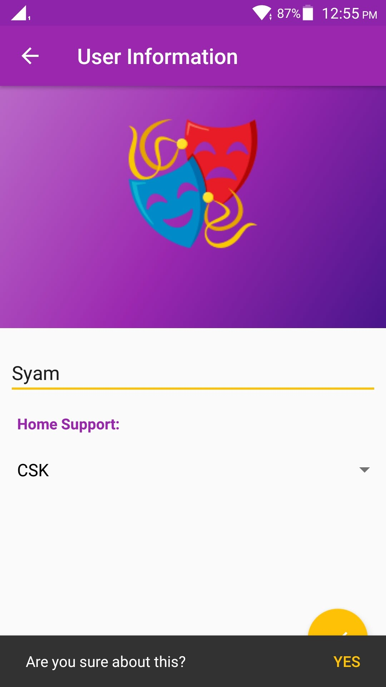
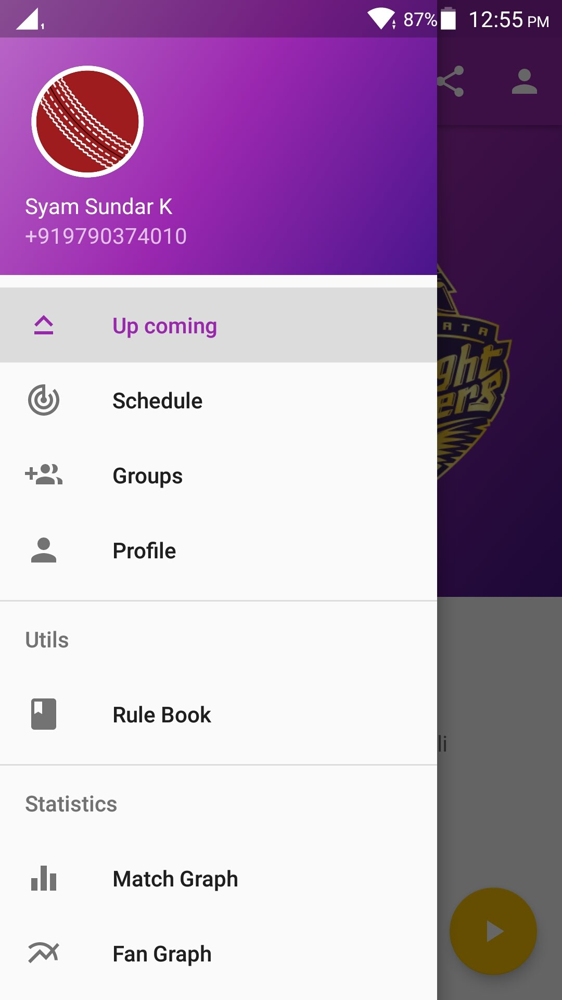

## Download it from - Play Store

    

